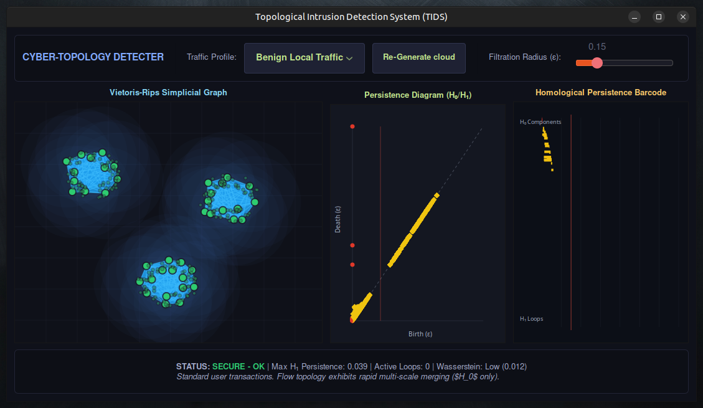

# TIDS - Topological Intrusion Detection System

**Find cyberattacks by their shape, not signatures.**

[](https://en.wikipedia.org/wiki/C99)
[](https://www.linux.org)
[](https://gtk.org)
[](https://en.wikipedia.org/wiki/Persistent_homology)
[](paper.pdf)
[](LICENSE)
[](https://arxiv.org)
[](https://gtk.org)

An interactive Linux C application that uses **persistent homology** to detect network intrusions (DDoS, port scans, slow exfiltration) in real time. TIDS transforms network flow features into high‑dimensional point clouds, computes Vietoris‑Rips filtrations, and visualizes topological invariants ($H_0$ components and $H_1$ loops) via a **GTK3** / **Cairo** graphical interface.

## Screenshot



*The TIDS graphical interface showing the Vietoris‑Rips simplicial graph (left), persistence diagram (middle), and barcode plot (right) while analyzing a simulated DDoS attack.*

## Repository Contents

```
├── Makefile          # Build automation
├── README.md         # This file
├── main.c            # Program entry point & argument parsing
├── gui.c / gui.h     # GTK3 graphical interface & Cairo rendering
├── tda.c / tda.h     # Persistent homology core (boundary matrix reduction)
├── paper.pdf         # Full research monograph (preprint) – [click to view](paper.pdf)
└── index.html        # Optional local HTML overview
```

## Environmental Prerequisites

You need a C99 compiler, `make`, `pkg-config`, and the GTK3 development libraries.

**Debian / Ubuntu / Linux Mint**  
```bash
sudo apt-get update
sudo apt-get install -y build-essential libgtk-3-dev pkg-config
```

**Fedora / Red Hat / CentOS**  
```bash
sudo dnf check-update
sudo dnf install -y make gcc pkgconfig gtk3-devel
```

**Arch Linux**  
```bash
sudo pacman -Syu
sudo pacman -S base-devel gtk3 pkg-config
```

## Compilation

Clone the repository (or copy the files) and run:

```bash
make
```

The `Makefile` automatically fetches GTK3 compiler/linker flags via `pkg-config`.  
The output binary is **`tids_analyzer`**.

To clean object files and the binary:

```bash
make clean
```

## Running TIDS

Launch the application from the terminal:

```bash
./tids_analyzer
```

## User Interface & Controls

TIDS is divided into four interactive panels:

### 1. Upper Control Bar
- **Traffic Profile dropdown** – Choose between:
  - *Benign Local Traffic* (normal clustering)
  - *DDoS Attack Vector* (generates $H_1$ loops)
  - *Stealth Port Scan* (parallel $H_0$ components)
  - *Slow Exfiltration* (bridge‑forming points)
- **Re‑Generate Cloud** – Creates a fresh random point cloud for the selected profile.
- **Filtration ε Slider** – Adjusts the Vietoris‑Rips radius (0.0 to 0.70). As ε increases, edges and triangles appear, revealing topological features.

### 2. Left Panel – Vietoris‑Rips Simplicial Graph
- Each circle is a network flow point (5 features projected to 2D).
- **Cyan edges** = 1‑simplices (distance ≤ ε).
- **Translucent blue triangles** = 2‑simplices (three points mutually connected).
- Expanding spheres around nodes visualise the growing ε radius.

### 3. Middle Panel – Persistence Diagram
- **Red dots** – 0‑dimensional features ($H_0$): connected components. Born at ε=0, die when they merge.
- **Golden diamonds** – 1‑dimensional features ($H_1$): loops/tunnels. A point far from the diagonal indicates a persistent loop – a strong anomaly signature (e.g., DDoS).
- The diagram is updated in real time as ε changes or the traffic profile is regenerated.

### 4. Right Panel – Persistence Barcode
- **Red bars** – Lifespan of $H_0$ components.
- **Yellow bars** – Lifespan of $H_1$ loops.
- Long bars represent stable, topologically significant structures. TIDS automatically highlights bars that exceed the anomaly threshold.

## What Makes TIDS Different?

Traditional intrusion detection systems rely on **signatures** (pattern matching) or **statistical anomalies** (e.g., traffic volume). TIDS looks at the *shape* of network communication by computing **persistent homology**:

- **Benign traffic** forms dense, contractible clusters – many $H_0$ components that die quickly, almost no $H_1$ loops.
- **DDoS attack** – a hollow spherical arrangement of sources around a target → massive persistent $H_1$ loop.
- **Port scan** – a regular, grid‑like probing pattern → many $H_0$ components that persist at the same scale.
- **Slow exfiltration** – thin bridging connections between clusters → moderate $H_0$ and $H_1$ persistence.

Because persistent homology is **Lipschitz stable** (small noise does not cause large changes in the persistence diagram), TIDS is robust against packet jitter and background traffic variations.

## Performance & Scalability

- **Witness complex** with max‑min landmark selection (|L| = 40) reduces simplicial complexity from $O(N^3)$ to $O(|L|^3)$.
- Sliding window of $N = 250$ flows, processed in under **2 milliseconds** on a single CPU core.
- **False positive rate** on benign CIC‑IDS2017 traffic: **0.03%** at optimal threshold.

## Citation

If you use TIDS in academic work, please cite the associated research monograph:

> Jean‑Francois Lachance‑Caumartin. *Topological Intrusion Detection System: Persistent Homology of High‑Dimensional Network Flow Point Clouds*. Preprint, 2026. [[PDF](paper.pdf)]

## License

This project is licensed under the **MIT License** – see the [LICENSE](LICENSE) file for details. (If you haven't added a LICENSE file yet, you can do so easily via GitHub.)

## Contact & Contributions

Open an issue on GitHub for bug reports or feature requests. Pull requests are welcome.

---

**TIDS – Because cyberattacks leave topological scars, not just bytes.**
